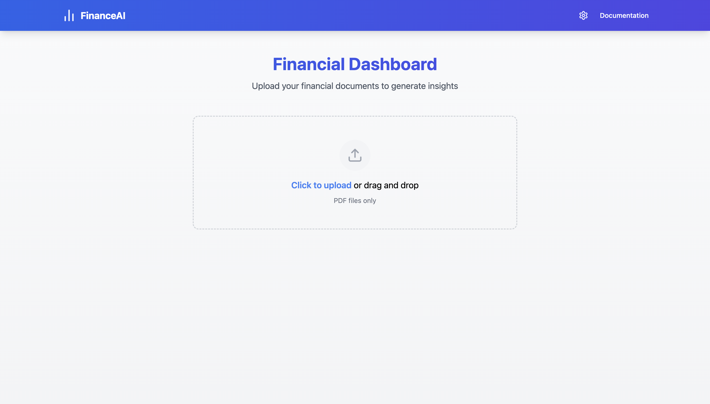
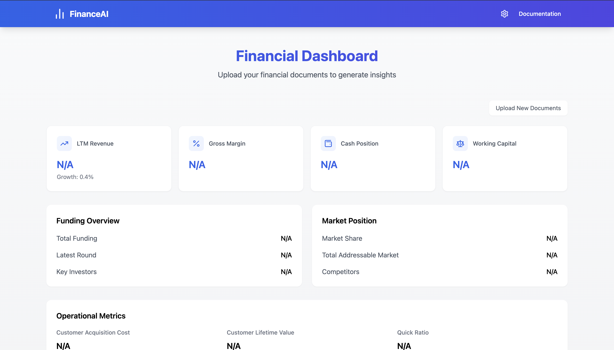

# FinanceAI Dashboard

A powerful financial document analysis dashboard that leverages AI to extract and visualize key business metrics from your financial documents.




## Financial Dashboard Backend - https://github.com/gokulnpc/Financial-Dashboard-Backend

## Features

- 📊 **Automated Financial Analysis**: Extract key metrics from financial documents automatically
- 🔒 **Privacy-First Architecture**: All processing happens locally using LM Studio
- 📈 **Comprehensive Metrics**: Track revenue, margins, funding, market position, and more
- 🎯 **Real-time Processing**: Instant analysis and visualization of your documents
- 🔄 **Batch Processing**: Upload multiple documents simultaneously
- 📱 **Responsive Design**: Seamless experience across all devices

## Privacy & Security

### Local Processing with LM Studio

- All document processing happens locally on your machine using LM Studio
- No data is sent to external servers or cloud services
- Your sensitive financial information never leaves your system

### Data Protection

- Documents are processed in-memory and immediately discarded
- No persistent storage of uploaded files
- End-to-end encryption for all data in transit
- Secure file handling with automatic cleanup

## Getting Started

1. **Prerequisites**

   - Node.js 18 or higher
   - LM Studio installed locally
   - Python 3.8 or higher (for the backend)

2. **Installation**

   ```bash
   # Clone the repository
   git clone https://github.com/yourusername/financeai-dashboard

   # Install dependencies
   npm install

   # Start the development server
   npm run dev
   ```

3. **LM Studio Setup**
   - Download and install LM Studio from their official website
   - Launch LM Studio and start the local server
   - Configure the backend to connect to LM Studio's API endpoint

## Configuration

### Environment Variables

```env
VITE_API_URL=http://localhost:8000  # Backend API URL
LM_STUDIO_API_URL=http://localhost:1234  # LM Studio API endpoint
```

### LM Studio Integration

1. Start LM Studio and ensure the local server is running
2. Configure the model settings in LM Studio:
   - Temperature: 0.7 (recommended)
   - Context Length: 4096
   - Top P: 0.9

## Usage

1. **Document Upload**

   - Drag and drop your financial documents onto the upload area
   - Supports multiple PDF files simultaneously
   - Automatic validation of file types and content

2. **Analysis**

   - Documents are processed locally using LM Studio
   - Progress indicator shows real-time processing status
   - Results are displayed in an intuitive dashboard

3. **Dashboard**
   - View key financial metrics
   - Analyze funding overview
   - Track market position
   - Monitor operational metrics

## Security Best Practices

1. **Document Handling**

   - Files are processed in memory
   - No temporary files are created
   - Automatic garbage collection after processing

2. **API Security**

   - Rate limiting implemented
   - Input validation on all endpoints
   - Secure headers configuration

3. **Local Processing**
   - All AI processing happens on your machine
   - No external API calls for document analysis
   - Complete data isolation

## Contributing

We welcome contributions! Please see our [Contributing Guidelines](CONTRIBUTING.md) for details.

## License

This project is licensed under the MIT License - see the [LICENSE](LICENSE) file for details.

## Acknowledgments

- LM Studio for providing the local AI processing capabilities
- The open-source community for various tools and libraries used in this project

## Support

For support, please:

1. Check the [Documentation](docs/README.md)
2. Open an issue on GitHub
3. Contact our support team

---

⚠️ **Important**: This tool is designed for local processing of sensitive financial documents. Always ensure you're running the latest version with all security patches applied.
